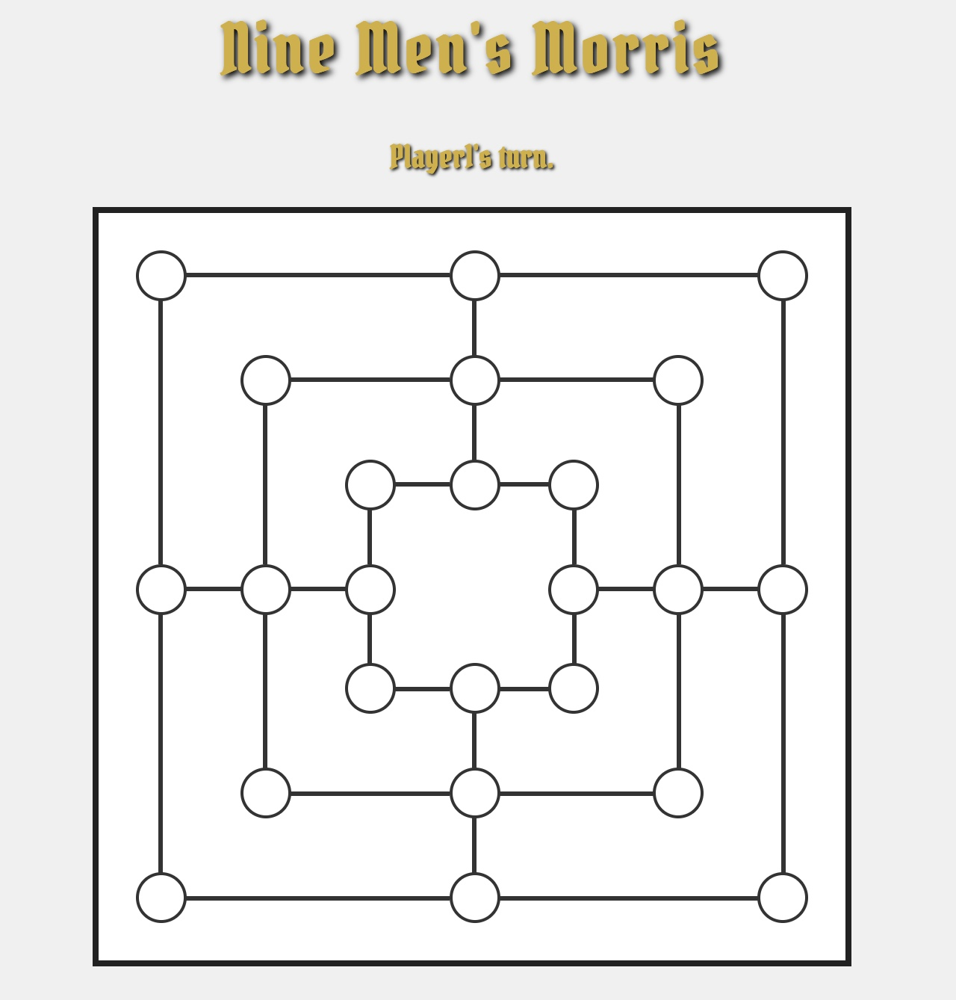
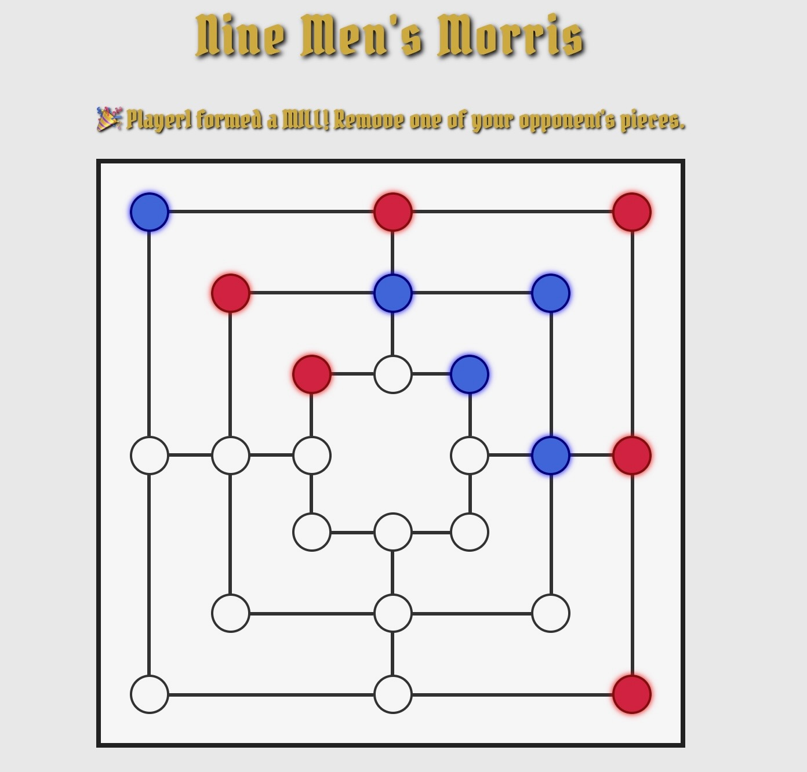

# Nine Men's Morris: Caribbean Conquest! 🏴‍☠️

NOTE: HTML and CSS are not finalized, this is meant to be a rough outline of how I want the game board to look.

## Table of Contents

## About the Game

Nine Men's Morris is a classic two-player strategy board game played on a grid of three concentric squares connected by lines, with a total of 24 playable spots. Each player starts with nine pieces, with the ultimate goal of reducing their oppenent to 2 or less pieces, or disallowing them from making any more legal moves.

The game is played in three distinct phases:

1.  **Placing Phase:** Players take turns placing their nine pieces on any empty spot on the board.
2.  **Moving Phase:** Once all pieces are placed, players move their pieces along the board's lines to adjacent empty spots.
3.  **Flying Phase:** If a player is reduced to only three pieces, they gain the ability to "fly" their pieces to any empty spot on the board, offering a last-ditch effort to form mills and survive!

Forming a "mill" (three of your pieces in a row along any line) allows you to remove one of your opponent's pieces from the board. The game ends when one player has fewer than three pieces, or is unable to make any legal moves.

## User Stories

* **As a player,** I want to click an empty spot to place my piece.
* **As a player,** I want to be visually shown when I form a mill.
* **As a player,** I want to click an opponent's piece to remove it after forming a mill.
* **As a player,** I want to select my piece and move it to an adjacent empty spot once all pieces are placed.
* **As a player,** I want to "fly" my pieces to any empty spot when I have only three pieces left.
* **As a player,** I want the game to clearly announce when a winner is determined.
* **As a player,** I want a "Play Again" button to easily restart the game.
* **As a player,** I want the game's interface to reflect a pirate theme.

## Features

* **Classic Nine Men's Morris Gameplay:** Fully implements the three phases: placing, moving, and flying.
* **Pirate/Caribbean Theme** 
* **Interactive Board:** Click-to-play interface for seamless interaction.
* **Status Updates:** Clear messages guide players through their turns, mill formations, and game outcomes.
* **Restart Game:** A "Sail Again!" button allows for quick resets and new adventures.

## Technologies Used

* **HTML** 
* **CSS** 
* **JavaScript**

## Minimum Viable Product (MVP)

* **Game Board UI:** A clean, interactive interface displaying the 24 playable spots, connecting lines, and player pieces. The UI will also show the current player's turn and game status messages.
* **Game State Management:** The application will track the board's current state (which spots are occupied by which player), the current game phase (placing, moving, flying), and each player's piece counts.
* **Two-Player Turn Logic:**
    * **Placing Phase:** Players take turns placing their 9 pieces onto empty spots.
    * **Mill Formation & Capture:** When a mill is formed, the current player is prompted to remove one of the opponent's non-mill pieces.
    * **Moving Phase:** Once all pieces are placed, players take turns selecting one of their pieces and moving it to an adjacent, empty spot.
    * **Flying Phase:** When a player is reduced to 3 pieces, they gain the ability to move their pieces to any empty spot.
* **Win/Loss Declaration:** At the end of the game, a clear message will announce the winner (either by reducing the opponent to fewer than 3 pieces or by blocking all their legal moves).
* **Reset Game:** A "Play Again" button will be available to reset the game board and state, allowing for new matches.

### How to Play

1.  **Placing Pieces (Phase 1):**
    * Players take turns clicking on any empty spot on the board to place one of their pieces.
    * Each player has 9 pieces to place.
    * If placing a piece forms a "mill" (three of your pieces in a row), you get to remove one of your opponent's pieces.
2.  **Moving Pieces (Phase 2):**
    * Once all 18 pieces are placed, the game transitions to the moving phase.
    * Click on one of your own pieces to select it.
    * Click on an **adjacent, empty spot** to move the selected piece.
    * Forming a mill still grants you the ability to remove an opponent's piece.
3.  **Flying Pieces (Phase 3):**
    * If a player's pieces on the board are reduced to **three**, that player enters the "flying" phase.
    * In this phase, you can move any of your three pieces to *any* empty spot on the board (not just adjacent ones).
    * Forming a mill still grants a removal.
4.  **Winning the Game:**
    * The game ends when an opponent has fewer than three pieces left on the board.
    * The game also ends if an opponent has no legal moves available.
5.  **Restarting:** Click the "Sail Again!" button that appears at the end of a game to start a new conquest.

## Project Status

This project is currently **in development**. The core `placing` and `moving` phases are implemented, along with mill detection and piece removal. The `flying` phase and comprehensive win condition checks are underway.
## Future Enhancements

* **Improved AI Opponent:** Develop a challenging AI that can play against the human player.
* **Sound Effects:** Add thematic sounds for piece placement, mill formation, and victories.
* **Animations:** Smooth animations for piece movement and removal.
* **Rules Enforcement:** More sophisticated rules for piece removal (e.g., not allowing removal of a piece in a mill if other pieces are available).
* **Undo/Redo Functionality:** 

